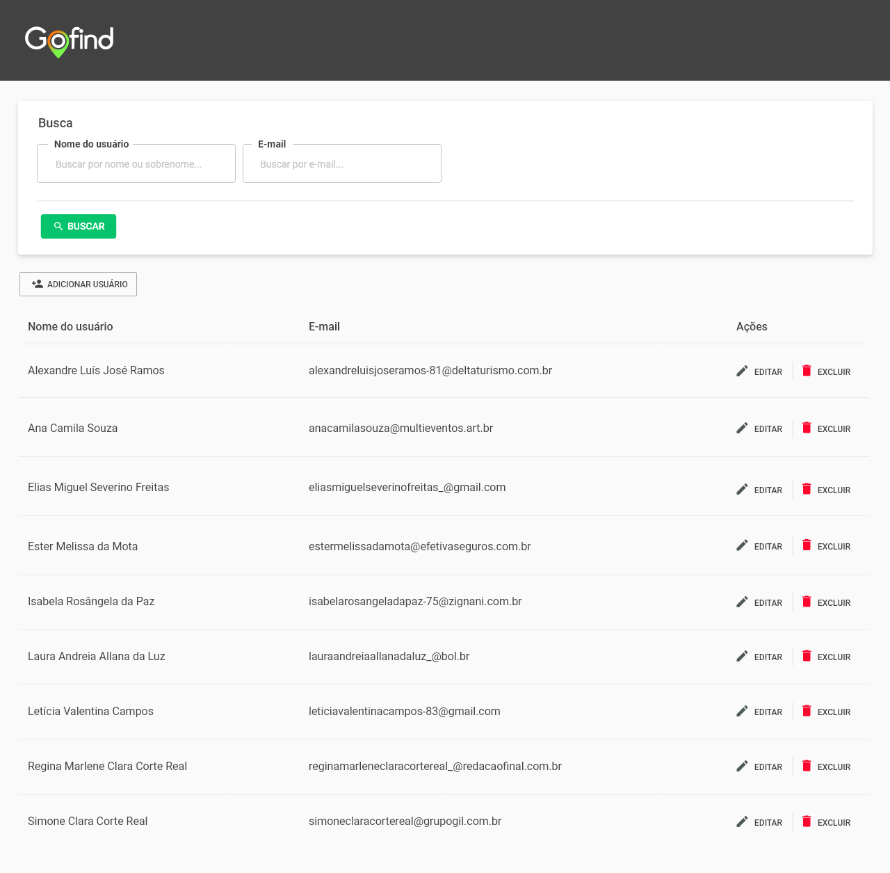
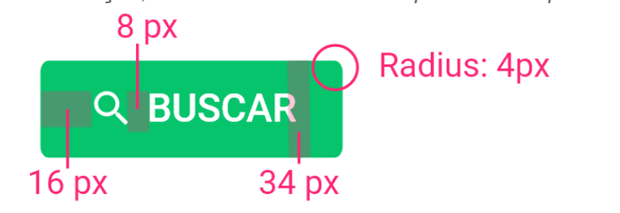
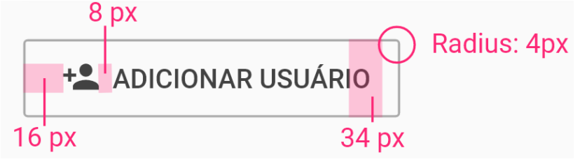

# Especificações visuais de estilo padrão

## Tela de Lista de Usuários sugerida:

Todas as telas desenvolvidas devem seguir o mesmo padrão proposto.

---

## Hierarquia de texto:

**Hierarquia de cores:**

Font-color (geral): #424242

Font-color (placeholders de campos de textos - inputs, selects, etc): #C4C4C4

---

**Hierarquia de texto:**

Labels de tabela: Roboto, 16px, médio

Textos das tabelas: Roboto, 16px, regular

Labels de campos de textos (inputs, select, etc): Roboto, 14px, regular

Placeholders de campos de texto: Roboto, 14px, regular

Títulos de modais: Roboto, 16px, médio

---

## Hierarquia de botões de ação

**Primário**

_“Usando sempre quando a ação for a principal ou final em tela. Exemplo: Ação de confirmação, salvar. Normalmente é aquele ‘botão que você quer que o usuário clique’.”_

Cor: #05C46B

Font style: Roboto, 14px, médio - caixa alta, #ffffff

Tamanho do ícone: altura - 16px (ícone Material design)

---

Secundário:
_“Usada para ações secundárias, de nível de importância inferior a primária. Muitas vezes utilizadas com ações que servem como prevenção de erros (ex.: cancelar), ações de fluxo (ex.: voltar) _

Border #AAAAAA

Font style: Roboto, 14px, médio - caixa alta, #424242

Tamanho do ícone: altura - 16px (ícone Material design)

---

**Terciário:**
_“Usando sempre que a ação não precisa de destaque, mas é preciso que tenha ela na tela para caso o usuário precise. Exemplo.: ação de fluxo como ‘Voltar’.”_

Font style: Roboto, 12px, médio - caixa alta, #424242, sublinhado

---

### Paleta de cores

**Cor de ação principal**

#05C46B botão de ação, não utilizar para outros fins

---

**Escala de cinza**

#424242

#727272

#AAAAAA

#C4C4C4

#EEEBEB

#FFFFFF

---

**Cores de alertas**

#FF042D

#fdd835

#aeea00

---

**Campo de textos**

Nós seguimos o modelo do Material de inputs.

https://material.io/components/text-fields#filled-text-field
